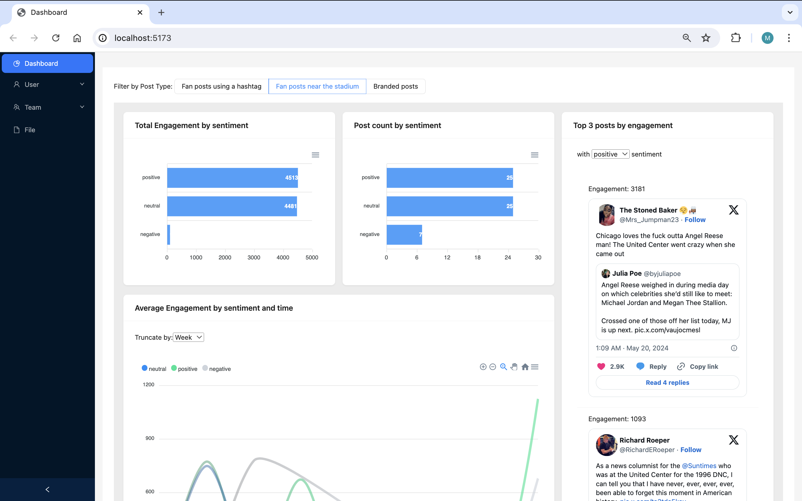

# Dashboard 

## Quick setup
### Docker
```sh
unzip miniproject.zip
cd miniproject
docker compose up
```

### Manual
```sh
git clone https://github.com/mengyanw/miniproject
cd miniproject
```

#### Set environment variable
```sh
cd backend
touch .env
vi .env
# .env file should look like this
API = https://api.blinkfire.com/developer/api/v1/posts
TOKEN = <your api token>
```

#### Install dependencies and run the app
```sh
cd backend
pip install -r requirements.txt
python manage.py migrate
python manage.py runserver 

cd frontend
npm install
npm run dev
```

#### Populate the database manually
```sh
cd backend
python manage.py populate_db
```

## Overview
1.	Pull in posts from the Chicago Bulls using the Posts Endpoint of the Blinkfire API. 
2.  Store the post data to PostGres.
3.	Run sentiment analysis on posts with HuggingFace models.
4.	Display a dashboard of the analytics.

I started by fetching data from the API and exploring the API documentation on Tuesday. To set up the app, I created the skeleton using Vue, Vite, Django, and PostgreSQL. I then gradually added routes and components to the app.

The app runs sentiment analysis on the text of the posts when the data is pulled down. All analysis and data aggregation are completed in the backend, with the frontend app using GET requests to retrieve the data. 

Additionally, I took this project as an opportunity to learn and use Vue. It is a new framework to me and I enjoy using it so far.

## Tools used
Backend: Django + PostgresSQL

Frontend: Vue 3 + Vite + antd

## Improvement
1. Add more charts to the dashboard
2. Add named player recognition / team recognition and display the results along with the sentiment of the posts
3. Learn more about Vue 3. Switch from using the Reactivity API to Vuex for state management to improve the structure and scalability of the application.
4. Migrate the database from PostgreSQL to Elasticsearch to improve search capabilities and performance.
5. Add user login

